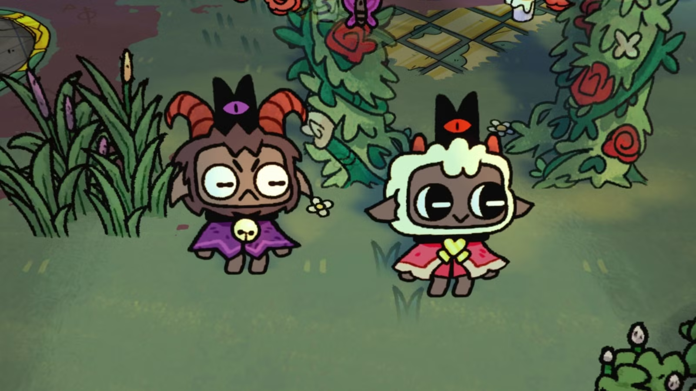
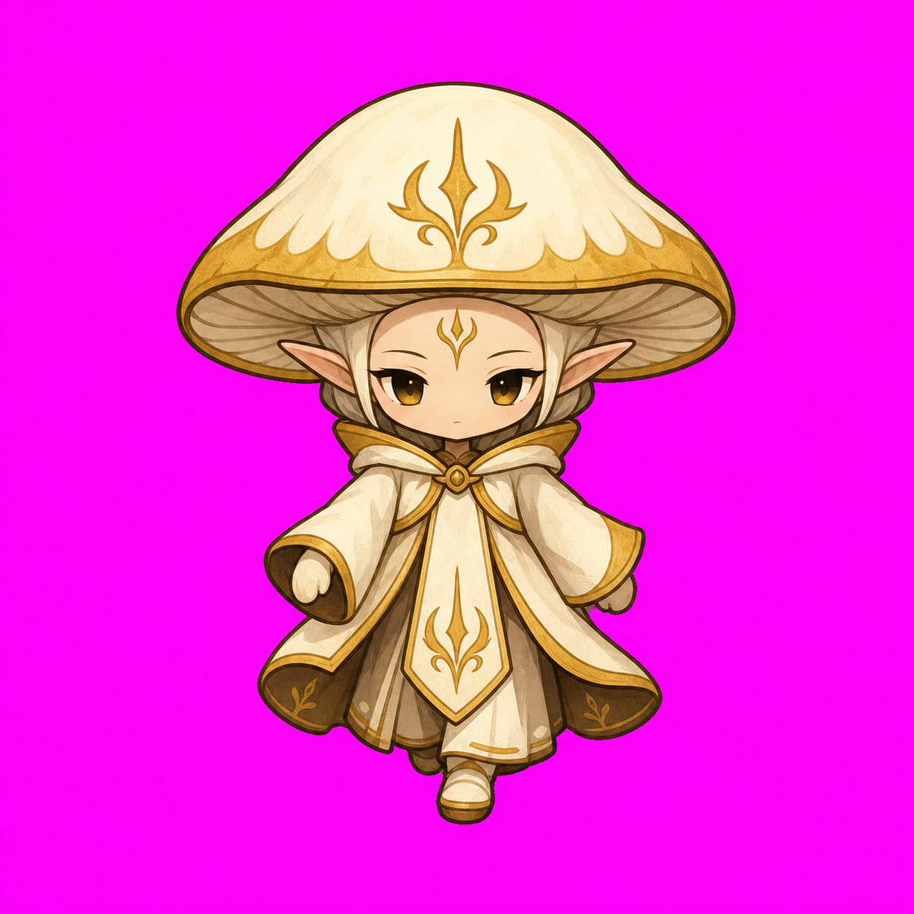

# Home Field Chibi Style Reference

Date: 2026-05-26

This is the checked-in reference for the chibi screenshot discussed in the agent run logs and current review thread. The bitmap was extracted from:

`/Users/microwavedev/workspace/microwave-hub/agent-viewer/temp/codex-019e28e1-1f3a-76b1-bc82-fe49df517631-rollout-2026-05-15T00-45-02-019e28e1-1f3a-76b1-bc82-fe49df517631.jsonl`

Source line: `7731`, user note: "i think it should be simpler like here".

Local reference image:

Additional liked Thalla direction from the 2026-06-22 Stage 1 rerun review:

Liked Thalla reference provenance:

- Source rollout: `/Users/microwavedev/workspace/microwave-hub/agent-viewer/temp/codex-019e69b6-1972-7462-a5ee-da953cc7723b-rollout-2026-05-27T14-53-22-019e69b6-1972-7462-a5ee-da953cc7723b.jsonl`
- Source event: user asked to save the liked image from the chat logs in the 2026-06-22 Stage 1 rerun review.
- Original attachment path in chat context: `/var/folders/3j/mvvy2gqj3d544j9n9pn0mxkc0000gn/T/codex-clipboard-8c17e4ed-b6cf-4cf7-8405-1c3afe8329b9.png`
- Local checked-in path: `docs/reference/home-field/chibi-thalla-liked-2026-06-23.png`
- Intent: positive user-preference snapshot for Thalla's face/cap/robe appeal and simple BJD-inspired chibi direction; not a runtime-ready sprite, not a canonical exact costume, and not permission to copy exact composition.

The screenshot is a non-owned external style reference, so do not copy characters, costumes, symbols, props, composition, or exact facial designs from it. Use it only to calibrate Home Field chibi proportions, top-down field readability, outline weight, BJD-inspired doll simplicity, and scene-scale simplicity.

## Target Read

Home Field chibis should feel close to the reference in these ways:

- squat field-sprite proportions with an oversized head and tiny grounded body;
- simple costume blocks that read immediately at mobile size;
- warm dark irregular outline, not clean vector icon edges;
- visible planted feet/base over the shared separate chibi shadow layer;
- expressive face that remains simple at `64px`;
- slightly elevated 2.5D field camera, with enough top/head/cap visible to belong on the map;
- cozy dark storybook mood, readable over muted green grass.
- BJD-inspired chibi doll appeal: smooth porcelain/resin-like face planes, small calm face features, rounded cheeks, simple mitten hands, tiny planted feet, and a quiet collectible-doll posture translated into hand-drawn game art.
- extremely low ornament count: one readable cap silhouette, one robe/body block, and only a few large gold identity marks.
- deliberately small sprite palette: `12-18` artist-visible colors, fewer than `20` total design colors, with shared cap/robe/skin/gold ramps rather than many near-duplicate tones.
- the 2026-06-23 liked Thalla image is a positive direction for the warmer face/cap/robe appeal, but it must be simplified and shifted to an elevated map-sprite read before runtime use.

## Palette Research Note

The current chibi problem is not only scale; it is palette discipline. Small game sprites read best when every color has a job. External sprite-art references point in the same direction:

- [2D Will Never Die's 16-color sprite workflow](https://2dwillneverdie.com/tutorial/so-you-want-your-sprites-to-be-16-colors/) treats color count as a real production constraint and shows that a sprite can often be reduced by merging tiny local shades into shared colors.
- [Derek Yu's pixel art tutorial](https://www.derekyu.com/makegames/pixelart.html) frames pixel art around tight constraints and notes that `16` and `32` color palettes are common; for our smaller `64px` runtime character, the lower end is the right target.
- [Lospec's palette database](https://lospec.com/palette-list) is built around finite palettes for pixel art, including many `16`-color examples; this supports picking a tiny swatch set up front instead of letting imagegen invent new shades.
- [Aseprite palette guidance](https://community.aseprite.org/t/how-do-i-make-cohesive-color-palettes-on-aseprite/7983) recommends shared/intersecting ramps and fewer shades for smaller sprites; that maps directly to Thalla's cap/robe/skin/gold problem.

For Home Field, the rule is therefore: generate the reference and grouped state sheet as if the artist had a visible swatch strip of fewer than `20` colors. Use one warm dark outline, shared dark shadows, shared bone highlights, a compact cap ramp, a compact robe/body ramp, a compact face ramp, and two gold identity tones. Do not let imagegen solve softness with extra beige, cream, blush, glow, or gold micro-tones.

## Important Differences

Do not copy the reference directly. For Mushroom Battles:

- reduce eye size versus the reference: eyes must not dominate the head or become huge white portrait eyes;
- keep Thalla's canon identity: ancient gold-white mushroom-elf sovereign, black eyes with fiery-gold life, visible elf ears when shown, restrained bone/gold/white/brown palette;
- use mushroom-elf biology, not animal/mascot/cult-character biology;
- avoid the reference's exact crown/horn/mask shapes, symbols, costumes, flowers, and UI/composition;
- keep final frames isolated on transparent backgrounds; no scene crops.
- do not become a realistic doll photo, glossy plastic toy render, fashion doll, or porcelain figurine render. The target is an illustration informed by BJD photos, not a photo-real object.
- do not add dense cap spotting, many gold droplets, lace-like robe marks, or facial micro-detail. At runtime scale, Thalla should read simpler and more doll-like than the current ornate candidate.
- do not use a large soft illustration palette. More than roughly `20` visible design colors is a style failure for this chibi surface.

## Current Rejection Note

Rejected examples:

- The old tiny beige Thalla candidate is not approved. It is mechanically readable, but it is too generic and lacks the stronger field-sprite personality, head/body silhouette, and Thalla-specific mushroom-elf sovereignty required by this reference.
- The 2026-06-20 Stage 1 candidate improved the silhouette and identity, but it is still too ornate: cap spots, gold markings, and costume detail make it read more like a busy fantasy sprite than a simple chibi BJD-style field doll. Regenerate with fewer marks and stronger doll-like simplicity.
- The 2026-06-22 grouped candidate passed mechanical checks, but its separately generated idle/walk cells drifted in style and details. Future state tiles for one character must come from one grouped source sheet and be split into chunks.
- The 2026-06-26 candidate passed mechanical checks after alpha recovery, but its palette remained too broad: too many pale/soft near-neighbor face, cap, robe, and gold tones made it feel like a sticker illustration rather than a compact field sprite. Future prompts must require fewer than `20` visible design colors.
