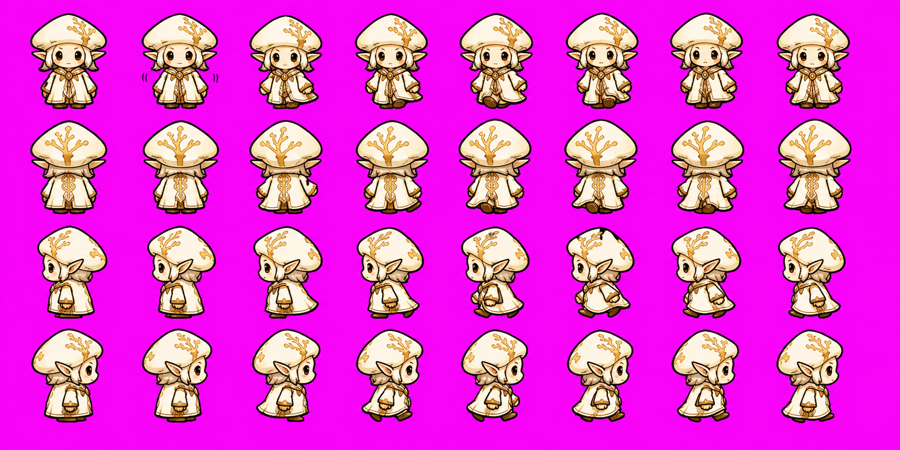

# Home Field Chibi Style Reference

Date: 2026-05-26

This is the checked-in reference for the chibi screenshot discussed in the agent run logs and current review thread. The bitmap was extracted from:

`/Users/microwavedev/workspace/microwave-hub/agent-viewer/temp/codex-019e28e1-1f3a-76b1-bc82-fe49df517631-rollout-2026-05-15T00-45-02-019e28e1-1f3a-76b1-bc82-fe49df517631.jsonl`

Source line: `7731`, user note: "i think it should be simpler like here".

Local reference image:

Additional liked Thalla direction from the 2026-06-22 Stage 1 rerun review:

Liked Thalla reference provenance:

- Source rollout: `/Users/microwavedev/workspace/microwave-hub/agent-viewer/temp/codex-019e69b6-1972-7462-a5ee-da953cc7723b-rollout-2026-05-27T14-53-22-019e69b6-1972-7462-a5ee-da953cc7723b.jsonl`
- Source event: user asked to save the liked image from the chat logs in the 2026-06-22 Stage 1 rerun review.
- Original attachment path in chat context: `/var/folders/3j/mvvy2gqj3d544j9n9pn0mxkc0000gn/T/codex-clipboard-8c17e4ed-b6cf-4cf7-8405-1c3afe8329b9.png`
- Local checked-in path: `docs/reference/home-field/chibi-thalla-liked-2026-06-23.png`
- Intent: positive user-preference snapshot for Thalla's face/cap/robe appeal and simple BJD-inspired chibi direction; not a runtime-ready sprite, not a canonical exact costume, and not permission to copy exact composition.

Previous best generated state-sheet direction from the 2026-06-26 Stage 1 run:

Previous best state-sheet provenance:

- Source local evidence: `.agent/home-field-workspace/rejected/chibi-thalla-state-attempt-20260626T213339Z/thalla_chibi.states.source.png`
- Source sha256: `cc42d08ef259b2293747fc53343ad9e391d9cdc644f6e90331b2fa78aa41b127`
- Local checked-in path: `docs/reference/home-field/chibi-thalla-previous-best-2026-06-26-state-sheet.png`
- Intent: positive reference for compact state-sheet proportions, appealing cap/body/face read, and coherent grouped-sheet identity. It is not approved production art: it still has too many visible design colors, too much ornament, and too much sticker/anime softness. Preserve its compact field-sprite charm while reducing palette and detail.

The screenshot is a non-owned external style reference, so do not copy characters, costumes, symbols, props, composition, or exact facial designs from it. Use it only to calibrate Home Field chibi proportions, top-down field readability, outline weight, BJD-inspired doll simplicity, and scene-scale simplicity.

## Target Read

Home Field chibis should feel close to the reference in these ways:

- squat field-sprite proportions with an oversized head and tiny grounded body;
- simple costume blocks that read immediately at mobile size;
- warm dark irregular outline, not clean vector icon edges;
- visible planted feet/base over the shared separate chibi shadow layer;
- expressive face that remains simple at `64px`;
- slightly elevated 2.5D field camera, with enough top/head/cap visible to belong on the map;
- cozy dark storybook mood, readable over muted green grass.
- BJD-inspired chibi doll appeal: smooth porcelain/resin-like face planes, small calm face features, rounded cheeks, simple mitten hands, tiny planted feet, and a quiet collectible-doll posture translated into hand-drawn game art.
- extremely low ornament count: one readable cap silhouette, one robe/body block, and only a few large gold identity marks.
- deliberately small sprite palette: `12-18` artist-visible colors, fewer than `20` total design colors, with shared cap/robe/skin/gold ramps rather than many near-duplicate tones.
- the 2026-06-23 liked Thalla image is a positive direction for the warmer face/cap/robe appeal, but it must be simplified and shifted to an elevated map-sprite read before runtime use.
- the 2026-06-26 previous-best state sheet is a positive direction for compact grouped-sheet proportions and charm, but its palette bloat and ornament must be fixed.

## Palette Research Note

The current chibi problem is not only scale; it is palette discipline. Small game sprites read best when every color has a job. External sprite-art references point in the same direction:

- [2D Will Never Die's 16-color sprite workflow](https://2dwillneverdie.com/tutorial/so-you-want-your-sprites-to-be-16-colors/) treats color count as a real production constraint and shows that a sprite can often be reduced by merging tiny local shades into shared colors.
- [Derek Yu's pixel art tutorial](https://www.derekyu.com/makegames/pixelart.html) frames pixel art around tight constraints and notes that `16` and `32` color palettes are common; for our smaller `64px` runtime character, the lower end is the right target.
- [Lospec's palette database](https://lospec.com/palette-list) is built around finite palettes for pixel art, including many `16`-color examples; this supports picking a tiny swatch set up front instead of letting imagegen invent new shades.
- [Aseprite palette guidance](https://community.aseprite.org/t/how-do-i-make-cohesive-color-palettes-on-aseprite/7983) recommends shared/intersecting ramps and fewer shades for smaller sprites; that maps directly to Thalla's cap/robe/skin/gold problem.

For Home Field, the rule is therefore: generate the reference and grouped state sheet as if the artist had a visible swatch strip of fewer than `20` colors. Use one warm dark outline, shared dark shadows, shared bone highlights, a compact cap ramp, a compact robe/body ramp, a compact face ramp, and two gold identity tones. Do not let imagegen solve softness with extra beige, cream, blush, glow, or gold micro-tones.

For tool and measurement follow-up, read [`docs/home-field-chibi-palette-cleanup-research.md`](home-field-chibi-palette-cleanup-research.md). That research records the 2026-06-30 Aseprite palette captures, the developer-cleaned Retro/Tetro-style sheet, and the recommendation to add a palette-audit helper. Palette cleanup can support diagnostics, but it does not override the biology/style gate: hair under the cap, glossy anime eyes, ornament, and large turnaround composition remain rejection signals even if the dominant color count improves.

## Important Differences

Do not copy the reference directly. For Mushroom Battles:

- reduce eye size versus the reference: eyes must be small dark seed/dot features and must not dominate the head, become glossy anime eyes, eyelashes, or huge white portrait eyes;
- keep Thalla's canon identity: ancient gold-white mushroom-elf sovereign, black eyes with fiery-gold life, visible elf ears when shown, restrained bone/gold/white/brown palette;
- show authority through cap silhouette, robe blocks, posture, and `1-2` flat mycelium/spore marks only; do not translate "sovereign", "regal", or "sacred regalia" into royal regalia, crown jewels, forehead gems, brooches, chest medallions, pendants, jewelry-like cap crests, gold filigree, scalloped collars, ornamental robe borders, decorative trim clusters, sleeve cuff trim, clasps, collar jewels, or repeated gold badges;
- use mushroom-elf biology, not animal/mascot/cult-character biology, not human hair or wig fringe under a mushroom hat;
- avoid the reference's exact crown/horn/mask shapes, symbols, costumes, flowers, and UI/composition;
- keep final frames isolated on transparent backgrounds; no scene crops.
- do not become a realistic doll photo, glossy plastic toy render, fashion doll, or porcelain figurine render. The target is an illustration informed by BJD photos, not a photo-real object.
- do not add dense cap spotting, many gold droplets, lace-like robe marks, or facial micro-detail. At runtime scale, Thalla should read simpler and more doll-like than the current ornate candidate.
- do not use a large soft illustration palette. More than roughly `20` visible design colors is a style failure for this chibi surface.
- do not overcorrect the palette rule into hard pixel art, clean vector/cel icon art, a large standalone anime turnaround sheet, quadrant-filling character art, or a cold "exactly 16 swatches" exercise that loses the warmer hand-drawn field-sprite charm.
- do not add earrings, jewelry clusters, fashion-doll styling, or baked foot/ground ovals like the stopped 2026-06-28 rerun; those are regressions from the previous better direction.
- do not add royal regalia, crown jewels, forehead gems, brooches, chest medallions, pendants, jewelry-like cap crests, gold filigree, scalloped collars, ornamental robe borders, decorative trim clusters, sleeve cuff trim, clasps, collar jewels, or repeated gold badges like the later stopped 2026-06-28 reference-gate reruns; those turn the field sprite back into a soft ornate showcase turnaround.

## Current Rejection Note

Rejected examples:

- The old tiny beige Thalla candidate is not approved. It is mechanically readable, but it is too generic and lacks the stronger field-sprite personality, head/body silhouette, and Thalla-specific mushroom-elf sovereignty required by this reference.
- The 2026-06-20 Stage 1 candidate improved the silhouette and identity, but it is still too ornate: cap spots, gold markings, and costume detail make it read more like a busy fantasy sprite than a simple chibi BJD-style field doll. Regenerate with fewer marks and stronger doll-like simplicity.
- The 2026-06-22 grouped candidate passed mechanical checks, but its separately generated idle/walk cells drifted in style and details. Future state tiles for one character must come from one grouped source sheet and be split into chunks.
- The 2026-06-26 candidate passed mechanical checks after alpha recovery, but its palette remained too broad: too many pale/soft near-neighbor face, cap, robe, and gold tones made it feel like a sticker illustration rather than a compact field sprite. Future prompts must require fewer than `20` visible design colors.
- The stopped 2026-06-28 rerun overcorrected the palette feedback: the reference became a large flat anime/fashion turnaround with earrings, and the grouped state sheet baked dark foot ovals into every frame. Future prompts must preserve the 2026-06-26 previous-best sheet's compact sprite charm while reducing palette/ornament; do not replace it with hard cel/vector/pixel-flat art.
- The later stopped 2026-06-28 reference-gate reruns avoided the hard pixel/cel overcorrection and restored some compact charm, but still failed because "sovereign/regal/sacred" wording kept pulling crown-like gems, medallions, ornamental trim, painterly cap texture, and broad soft palettes. Future imagegen prompts should prefer field-sprite/status language, require tiny source-sprite views, and say authority is silhouette/posture/flat mycelium marks only.
- The 2026-06-28 run `codex-019f1042-1bb8-7831-8a2b-0e5b4c746c02` obeyed the two-attempt stop rule and improved layout, but text-only imagegen still produced glossy anime eyes, hair/hat reads, robe/collar trim, repeated gold marks, and quadrant-filling character art. Future prompts must constrain face budget, cap-as-biology, and figure occupancy before another retry.
- The later 2026-06-28 run `codex-019f105b-b55a-7ad0-9f8d-38903fdf7999` proved that even the fully tightened text-only prompt still produces oversized character-turnaround art with anime eyes, hair/hat biology drift, palette bloat, and robe/cap ornament. Future Thalla reference generation should be image-guided from the checked-in previous-best, liked Thalla, and style reference PNGs; if the tool cannot attach or use those PNGs as actual same-context image inputs, stop instead of doing more text-only retries.
- The 2026-06-29 run `codex-019f140b-07a4-7e10-85e1-f64c9d8a0bdb` proved that the old image-guided turnaround prompt still failed after the run loaded those references for viewing: both outputs were large soft/painterly character-sheet figures instead of tiny source-sprite views. Future reference prompts must be sprite-box extraction guides with tiny invisible `96x96` boxes and mostly empty `#ff00ff`, not conventional turnaround sheets.
- The 2026-06-29 run `codex-019f1482-8954-7b52-9f75-b377cf957645` proved that the sprite-box prompt still fails when the run only passively views the references before imagegen. Future runs need actual imagegen input binding for the checked-in PNGs. For built-in imagegen, `view_image` is acceptable only as the current imagegen skill's same-context input-staging step when the following built-in `image_gen` call explicitly uses those visible images as references; `view_image` plus a later text-only prompt remains text-only-equivalent for this gate.
